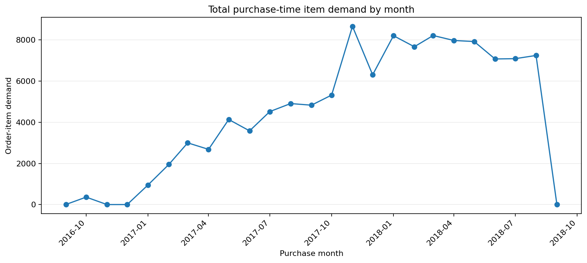
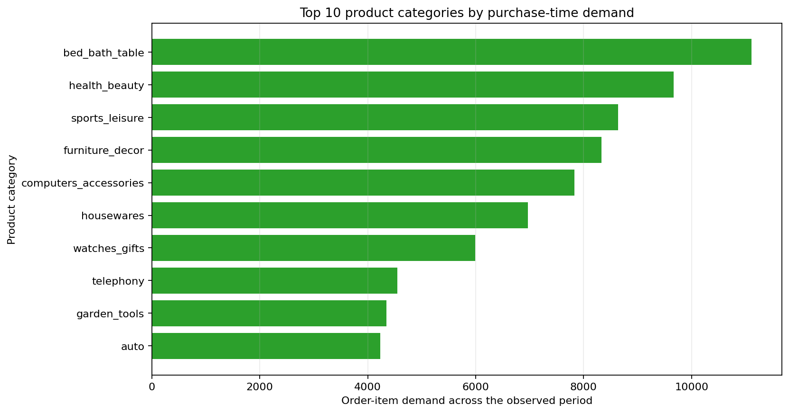
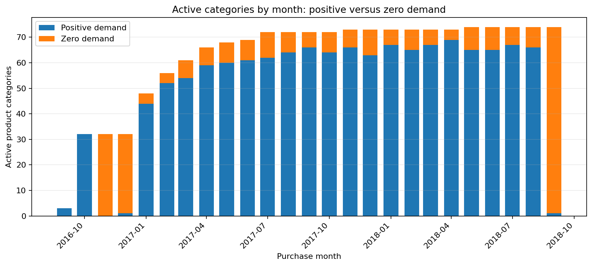

# Phân tích dữ liệu TV1 - Olist Product Sales

Báo cáo được tạo trực tiếp từ raw CSV bằng `python -m src.run_data_pipeline`; mọi số liệu dưới đây là quan sát thực tế, không phải ví dụ.

## Dữ liệu đầu vào

| table | rows | columns | duplicate rows |
| --- | --- | --- | --- |
| orders | 99441 | 8 | 0 |
| order_items | 112650 | 7 | 0 |
| products | 32951 | 9 | 0 |
| category_translation | 71 | 2 | 0 |

Khoảng purchase timestamp: **2016-09-04T21:15:19** đến **2018-10-17T17:30:18**. Timestamp không hợp lệ/thiếu: **0**.

Phân bố order status: `{"approved": 2, "canceled": 625, "created": 5, "delivered": 96478, "invoiced": 314, "processing": 301, "shipped": 1107, "unavailable": 609}`.

Toàn bộ dtype và missing count được lưu trong `data/processed/preprocessing_metadata.json` tại `raw_audit`; pipeline không tự tạo hoặc impute giá trị raw.

## Làm sạch và định nghĩa demand tại cutoff

- Sự kiện demand: `Count order-item demand at order_purchase_timestamp; include every order status with a valid purchase timestamp.`
- Chính sách order status: `Audit only; final order status is not used to select demand events.` Điều này chặn hindsight: final status ghi nhận sau cutoff không thể chọn purchase event của tháng trước.
- Record có purchase timestamp không hợp lệ bị loại trước aggregate.
- Category dùng bản dịch tiếng Anh nếu có; nếu không dùng source category; nếu vẫn thiếu dùng `unknown_category`.
- Price, freight và product attribute không backfill từ tương lai: zero-demand gap chỉ forward-fill quá khứ cùng category, sau đó dùng train median khi preprocessing.
- Không outlier nào bị xóa/cắt. Thống kê kiểm tra nằm trong metadata `outlier_summary`.

## Kiểm tra join

| left | right | key | expected cardinality | left rows | rows after | unmatched-left rate |
| --- | --- | --- | --- | --- | --- | --- |
| orders (valid purchase timestamp) | order_items | order_id | one_to_many | 99441 | 112650 | 0.78% |
| orders + order_items | products | product_id | many_to_one | 112650 | 112650 | 0.00% |
| orders + items + products | category_translation | product_category_name | many_to_one | 112650 | 112650 | 1.44% |

`pandas.merge(validate=...)` ép từng cardinality đã khai báo; many-to-many ngoài dự kiến sẽ làm pipeline fail thay vì làm phồng demand im lặng.

## Category-month và target

Một dòng là một `product_category × feature_month`. Lịch của mỗi category bắt đầu từ tháng purchase đầu tiên quan sát được của chính category đó và kéo dài đến tháng quan sát cuối toàn cục. Tháng thiếu sau mốc đó có `sales_current = 0`; tháng trước lần quan sát đầu tiên không bị bịa thành zero-demand history.

Target **`sales_next_month`** là purchase-time order-item demand của category trong tháng lịch kế tiếp. Target được tạo sau active-window grid bằng forward group shift một dòng. Dòng thiếu ba sales lag hoặc future target bị loại khỏi model-ready table.

## EDA trực quan

Ba biểu đồ dưới đây được sinh lại tự động từ active-window panel ở mỗi pipeline run, không phải ảnh tạo thủ công.

- Demand tháng cao nhất: **2017-11** với **8665** order-item.
- Category có tổng demand cao nhất: **bed_bath_table** với **11115** order-item.
- Active category-month có zero-demand: **280** dòng (17.91%).
- Khoảng raw data bắt đầu ở ngày **2016-09-04** và kết thúc ở ngày **2018-10-17**; tháng đầu/cuối là tháng chưa đủ nên không nên so sánh trực tiếp với tháng hoàn chỉnh.

## Đặc tả feature cuối

| feature | formula | available at | leakage assessment |
| --- | --- | --- | --- |
| sales_current | Count of order-item demand rows for category in feature month t. | End of month t. | Uses purchase events in month t only; final order status is not used. |
| sales_lag_1 | Category sales in t-1 after completing the monthly grid. | End of month t. | Explicit backward shift only. |
| sales_lag_2 | Category sales in t-2 after completing the monthly grid. | End of month t. | Explicit backward shift only. |
| sales_lag_3 | Category sales in t-3 after completing the monthly grid. | End of month t. | Explicit backward shift only. |
| rolling_sales_mean_3 | mean(sales_current(t), sales(t-1), sales(t-2)) | End of month t. | Does not include sales(t+1) or any later value. |
| month_sin | sin(2π × calendar_month(t) / 12). | End of month t. | Derived from the feature-month calendar only. |
| month_cos | cos(2π × calendar_month(t) / 12). | End of month t. | Derived from the feature-month calendar only. |
| year | Calendar year of feature month t. | End of month t. | Derived from the feature-month calendar only. |
| orders_current | Number of distinct purchase-time order_id values for the category in month t. | End of month t. | Uses purchase events in month t only; final order status is not used. |
| unique_products_current | Number of distinct product_id values for the category in month t. | End of month t. | Uses month t only. |
| avg_price_current | Mean item price for category order-items in month t. | End of month t; zero-sales gaps use past-only forward fill then train median. | Neither aggregation nor fill looks into future months. |
| avg_freight_current | Mean freight value for category order-items in month t. | End of month t; zero-sales gaps use past-only forward fill then train median. | Neither aggregation nor fill looks into future months. |
| avg_product_weight | Mean product_weight_g of products ordered in the category in month t. | End of month t; zero-sales gaps use past-only forward fill then train median. | Neither aggregation nor fill looks into future months. |
| avg_product_length | Mean product_length_cm of products ordered in the category in month t. | End of month t; zero-sales gaps use past-only forward fill then train median. | Neither aggregation nor fill looks into future months. |
| avg_product_height | Mean product_height_cm of products ordered in the category in month t. | End of month t; zero-sales gaps use past-only forward fill then train median. | Neither aggregation nor fill looks into future months. |
| avg_product_width | Mean product_width_cm of products ordered in the category in month t. | End of month t; zero-sales gaps use past-only forward fill then train median. | Neither aggregation nor fill looks into future months. |
| avg_product_description_length | Mean product_description_lenght of products ordered in the category in month t. | End of month t; zero-sales gaps use past-only forward fill then train median. | Neither aggregation nor fill looks into future months. |
| avg_product_photos_qty | Mean product_photos_qty of products ordered in the category in month t. | End of month t; zero-sales gaps use past-only forward fill then train median. | Neither aggregation nor fill looks into future months. |
| product_category | Category label, one-hot encoded from train categories only. | Known before the forecast cutoff. | No target or future sales used; unknown validation/test categories are all-zero encoded. |

## Temporal split

| split | target start | target end | target months | rows |
| --- | --- | --- | --- | --- |
| train | 2017-01 | 2018-02 | 14 | 755 |
| validation | 2018-03 | 2018-05 | 3 | 219 |
| test | 2018-06 | 2018-09 | 4 | 293 |

All rows for a target month are placed in one split. The assertions require train < validation < test with no target-month overlap.

## Kiểm tra outlier

| field | non-missing | min | median | p99 | max |
| --- | --- | --- | --- | --- | --- |
| avg_price_current | 1267 | 3.9 | 110.0 | 1127.8818095238094 | 3549.0 |
| avg_freight_current | 1267 | 0.11 | 18.68504854368932 | 60.601030769230626 | 88.56 |
| sales_current | 1267 | 0.0 | 19.0 | 746.3399999999999 | 981.0 |

Giá trị lớn được giữ lại trừ khi không hợp lệ. Đây là báo cáo kiểm tra, không phải quy tắc clipping.

## Mẫu kiểm tra lag/target thủ công

Hai mẫu theo thời gian dưới đây được tạo từ model-ready data. Trong mỗi mẫu, `sales_next_month` là `sales_current` của tháng kế tiếp trong cùng category.

### `agro_industry_and_commerce`

| feature month | sales_lag_2 | sales_lag_1 | sales_current | sales_next_month |
| --- | --- | --- | --- | --- |
| 2017-04 | 7.0 | 2.0 | 0 | 4.0 |
| 2017-05 | 2.0 | 0.0 | 4 | 1.0 |
| 2017-06 | 0.0 | 4.0 | 1 | 1.0 |
| 2017-07 | 4.0 | 1.0 | 1 | 4.0 |
| 2017-08 | 1.0 | 1.0 | 4 | 4.0 |
### `air_conditioning`

| feature month | sales_lag_2 | sales_lag_1 | sales_current | sales_next_month |
| --- | --- | --- | --- | --- |
| 2017-01 | 0.0 | 0.0 | 4 | 12.0 |
| 2017-02 | 0.0 | 4.0 | 12 | 17.0 |
| 2017-03 | 4.0 | 12.0 | 17 | 16.0 |
| 2017-04 | 12.0 | 17.0 | 16 | 8.0 |
| 2017-05 | 17.0 | 16.0 | 8 | 11.0 |

## Kiểm tra leakage

- `sales_next_month`, `target_month` và date keys bị loại khỏi mọi model matrix.
- Category grid bắt đầu tại first observation, nên category chỉ xuất hiện ở validation/test không bị chèn vào train dưới dạng synthetic zero row.
- Lag/target assertion tính lại shift từ active-window panel ở mỗi pipeline run.
- Preprocessor chỉ fit từ train và được lưu trong metadata.
- Train, validation và test có feature order giống nhau cùng giá trị số hữu hạn.

## Giới hạn và phần việc tiếp theo

- Target là purchase-time demand quantity (order-item count), không phải revenue, delivered sales hoặc customer lifetime value.
- First observed purchase month là active-window boundary trong dữ liệu, không chứng minh đây là ngày launch thật của category.
- Olist không có age, gender, campaign hoặc ad-spend trực tiếp; không field nào bị bịa.
- TV2 phụ trách model algorithm; TV3 phụ trách experiment tracking, model selection và final metric.
