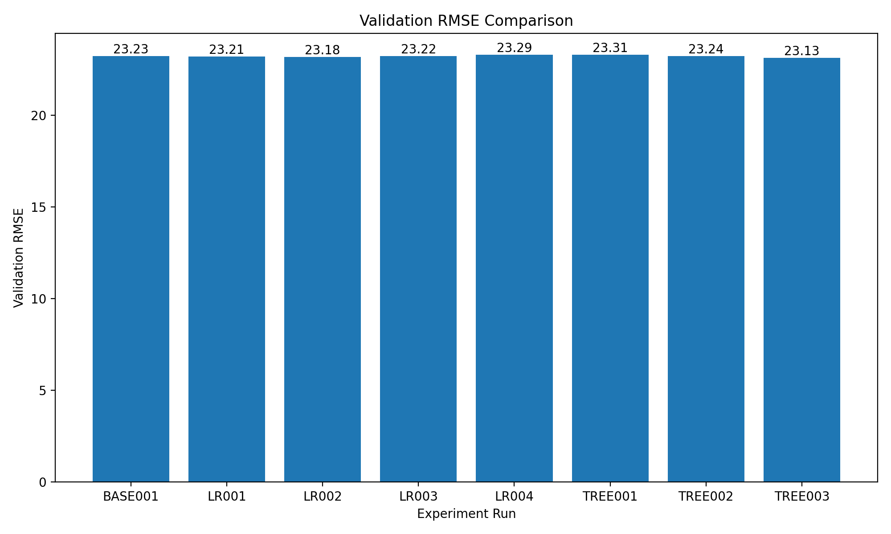

# Model Comparison Report

Báo cáo này được sinh tự động từ `logs/experiments.csv` và `logs/final_test.json`.

## 1. Experiment Results

| Run ID | Model | Validation MAE | Validation RMSE | Validation R2 |
|---|---|---:|---:|---:|
| BASE001 | MeanBaseline | 20.0819 | 23.2253 | -0.0112 |
| LR001 | LinearRegressionScratch | 20.0606 | 23.2099 | -0.0098 |
| LR002 | LinearRegressionScratch | 20.0021 | 23.1762 | -0.0069 |
| LR003 | LinearRegressionScratch | 19.9790 | 23.2172 | -0.0105 |
| LR004 | LinearRegressionScratch | 19.9935 | 23.2880 | -0.0167 |
| TREE001 | DecisionTreeRegressorScratch | 20.0830 | 23.3061 | -0.0182 |
| TREE002 | DecisionTreeRegressorScratch | 20.0457 | 23.2356 | -0.0121 |
| TREE003 | DecisionTreeRegressorScratch | 19.9256 | 23.1282 | -0.0027 |

## 2. Validation RMSE Visualization

## 3. Best Model Selection

Tiêu chí chính để chọn best model là **Validation RMSE**, trong đó giá trị càng thấp càng tốt.

- Best Run: **TREE003**
- Model: **DecisionTreeRegressorScratch**
- Validation MAE: **19.9256**
- Validation RMSE: **23.1282**
- Validation R2: **-0.0027**

## 4. Final Test Evaluation

Sau khi best configuration được chọn bằng validation set, model cuối được train lại trên Train + Validation và sau đó mới đánh giá trên Test Set.

- Selected Run: **TREE003**
- Model: **DecisionTreeRegressorScratch**
- Test MAE: **20.7680**
- Test MSE: **565.1858**
- Test RMSE: **23.7736**
- Test R2: **-0.0180**

## 5. Conclusion

Model được chọn dựa trên validation data, không sử dụng test set để tune hyperparameter.

Final test chỉ được sử dụng sau khi best configuration đã được xác định.